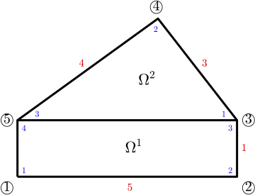
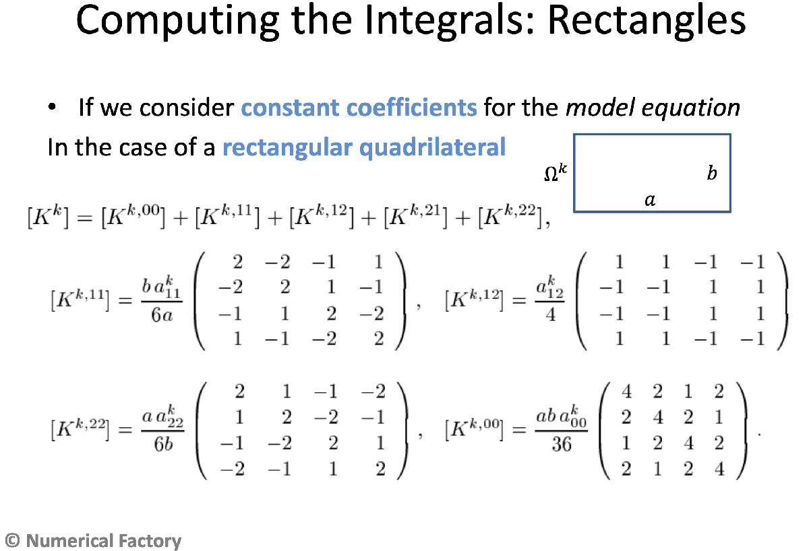
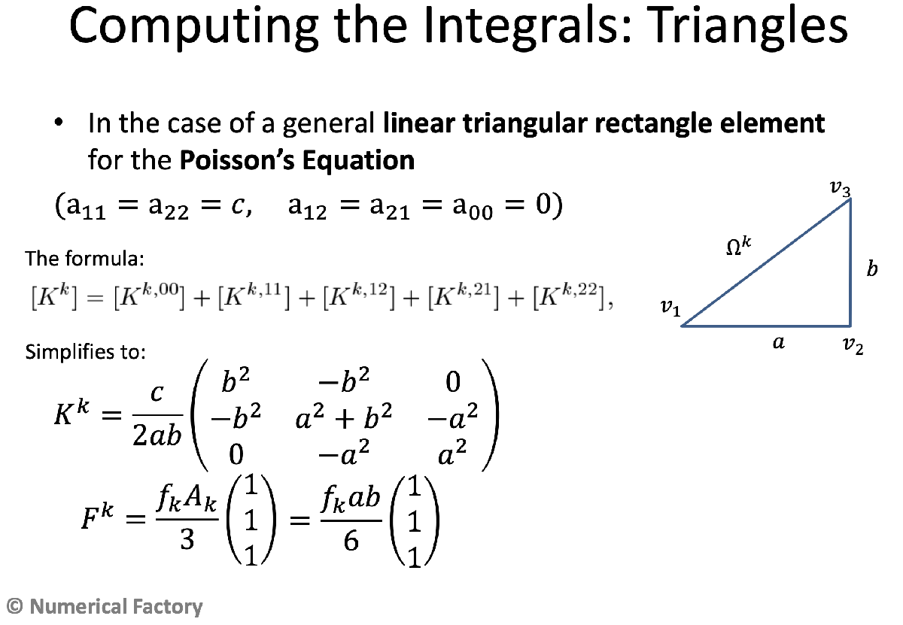

# 240032\-24\-ex\-final\-q1\-2023\-24
# P2

Consider the equation $-c\Delta u=0$ on the domain $\mathcal{D}=\Omega^1 \cup \Omega^2$ meshed with two elements and connectivity matrix $C=\left(\begin{array}{cccc} 1 & 2 & 3 & 5\newline 3 & 4 & 5 & \ast  \end{array}\right)$ . $\Omega^1$ is a rectangle with node $1$ in $(0,0)$ , whose edge 1\-2 lies in the $OX$ axis. Edge 1\-2 of length $5$ and edge 2\-3 of length $1$ . $\Omega^2$ is a right triangle with edge 3\-4 of length $3$ and edge 4\-5 of length $4$ . The value of $c$ is $30$ in $\Omega^1$ and $48$ in $\Omega^2$ .


 **Hint.** Due to the shape of the elements, there is no need to compute the nodes' coordinates.

# Part (a)

(a) (2 points) The values of $K_{2,3}^1$ and $K_{1,2}^2$ are,

-  $-34$ and $-9$ 
-  $-46$ and $-16$ 
-  Leave it empty (no penalty) 
-  $-41$ and $-18$ 
-  $-49$ and $-32$ ✅ 
### Solution

Taking into account the edges' lengths told in the  the text and the connectivity matrix, $C=\left(\begin{array}{cccc} 1 & 2 & 3 & 5\newline 3 & 4 & 5 & \ast  \end{array}\right)$ , we can sketch the tilling of the domain $\mathcal{D}$ into the elements $\Omega^1$ (rectangle) and $\Omega^2$ (right  triangle), as shown in the figure below.





**Figure 1**


 **Local stiffness matrices.** To compute the local stiffness matrix of $\Omega^1$ , we can use the explicit formulas for rectangular quadrilateral elements, when the coefficients of the model equation are constant. These formulas have been discussed in class, and can be found [in the notes on the FEM available at the *Numerical Factory*,](https://numfactory.upc.edu/numfactory/subjects/FEM/FEM/theory/T2-MN-FEM2D.pdf) page 28:





Here $k=1$ is the number of the element, the length of the edge joining the local nodes $1$ and $2$ is $a=5$ , the length of the edge joining the local nodes $2$ and $3$ is $b=1$ , $a_{1,1}^1 =a_{2,2}^1 =c=30$ , $a_{1,2}^1 =a_{2,1}^1 =a_{0,0}^1 =0$ . Hence $K^{1,12} =K^{1,21} =K^{1,00} =0$ and then

 $$ K^1 =K^{1,11} +K^{1,22} =\left(\begin{array}{rrrr} 2 & -2 & -1 & 1\newline -2 & 2 & 1 & -1\newline -1 & 1 & 2 & -2\newline 1 & -1 & -2 & 2 \end{array}\right)+25\left(\begin{array}{rrrr} 2 & 1 & -1 & -2\newline 1 & 2 & -2 & -1\newline -1 & -2 & 2 & 1\newline -2 & -1 & 1 & 2 \end{array}\right)=\left(\begin{array}{rrrr} 52 & 23 & -26 & -49\newline 23 & 52 & -49 & -26\newline -26 & -49 & 52 & 23\newline -49 & -26 & 23 & 52 \end{array}\right) $$ 

To compute the local stiffness matrix of $\Omega^2$ , we can use the explicit formula that apply when the element $\Omega^k$ is a right triangle, with local node $2$ placed at the right angle's vertex (see figure below) and the coefficients of the model equation are constants and equal to $a_{1,1}^k =a_{2,2}^k =c$ , $a_{1,2}^k =a_{2,1}^k =a_{0,0}^k =0$ . This formula has been discussed in class and can be found [in the notes of the FEM available at the *Numerical Factory*](https://numfactory.upc.edu/numfactory/subjects/FEM/FEM/theory/T2-MN-FEM2D.pdf), page 28:





Here $k=2$ is the number of the element, the length of the edge joining the local nodes $1$ and $2$ is $a=3$ , the length of the edge joining the nodes $2$ and $3$ is $b=1$ (see the sketch of the meshed domain above, and note also that the local node $2$ is at the right angle's vertex), and $c=48$ 

 $$ K^2 =\left(\begin{array}{rrr} 32 & -32 & 0\newline -32 & 50 & -18\newline 0 & -18 & 18 \end{array}\right) $$ 

Therefore, the solution of part (a) is: $K_{2,3}^1 =-49$ , $k_{1,2}^2 =-32$ .

```matlab
clearvars
close all

nodes = [0,0; 
    5,0;
    5,1;
    16/5, 14/5;
    0,1];

elem = [1,2,3,5;
    3,4,5,5];

%Element 1
a = 5; b = 1; c = 30;
K1 = b*c*[2, -2, -1, 1;
    -2, 2, 1, -1;
    -1, 1, 2, -2;
    1, -1, -2, 2]/6/a + a*c*[2,1,-1,-2;
      1,2,-2,-1;
      -1,-2,2,1;
      -2,-1,1,2]/6/b
```

```matlabTextOutput
K1 = 4x4
    52    23   -26   -49
    23    52   -49   -26
   -26   -49    52    23
   -49   -26    23    52

```

```matlab
%Element 2
a = 3; b = 4; c = 48;
K2 =c*[b^2, -b^2, 0;
    -b^2, a^2 + b^2, -a^2;
    0, -a^2, a^2]/2/a/b
```

```matlabTextOutput
K2 = 3x3
    32   -32     0
   -32    50   -18
     0   -18    18

```

```matlab
fprintf('(a) K1(2,3) = %f, K2(1,2) = %f\n',K1(2,3),K2(1,2))
```

```matlabTextOutput
(a) K1(2,3) = -49.000000, K2(1,2) = -32.000000
```
# Part (b)

(b) (3 points) The value of $K_{3,5}$ is,

-  $\displaystyle -7$ 
-  Leave it empty (no penalty) 
-  $\displaystyle 7$ 
-  $\displaystyle 17$ 
-  $23$ ✅ 

**Solution**


The global assembled matrix is:


 $K=\left(\begin{array}{ccccc} K_{1,1}^1  & K_{1,2}^1  & K_{1,3}^1  & 0 & K_{1,4}^1 \newline K_{2,1}^1  & K_{2,2}^1  & K_{2,3}^1  & 0 & K_{2,4}^1 \newline K_{3,1}^1  & K_{3,2}^1  & K_{3,3}^1 +K_{1,1}^2  & K_{1,2}^2  & K_{3,4}^1 +K_{1,3}^2 \newline 0 & 0 & K_{2,1}^2  & K_{2,2}^2  & K_{2,3}^2 \newline K_{4,1}^1  & K_{4,2}^1  & K_{4,3}^1 +K_{3,1}^2  & K_{3,2}^2  & K_{4,4}^1 +K_{3,3}^2  \end{array}\right)=\left(\begin{array}{rrrrr} 52 & 23 & -26 & 0 & -49\newline 23 & 52 & -49 & 0 & -26\newline -26 & -49 & 84 & -32 & 23\newline 0 & 0 & -32 & 50 & -18\newline -49 & -26 & 23 & -18 & 70 \end{array}\right)$ .


Per tant $K_{3,5} =23$ .

```matlab
numNodes = size(nodes,1);
numElem = size(elem,1);
K = zeros(numNodes);

%Assemble matrices K1 & K2
rows = elem(1,:); cols = rows;
K(rows,cols) = K(rows,cols) + K1;

rows = elem(2,1:3); cols = rows;
K(rows,cols) = K(rows,cols) + K2;

fprintf('%6.1f %6.1f %6.1f %6.1f %6.1f\n',K.')
```

```matlabTextOutput
  52.0   23.0  -26.0    0.0  -49.0
  23.0   52.0  -49.0    0.0  -26.0
 -26.0  -49.0   84.0  -32.0   23.0
   0.0    0.0  -32.0   50.0  -18.0
 -49.0  -26.0   23.0  -18.0   70.0
```

```matlab
fprintf('(b) K(3,5) = %f',K(3,5))
```

```matlabTextOutput
(b) K(3,5) = 23.000000
```
#  Part (c)

(c) (3 points) Assume that we have a boundary conditions $u(x,y)\equiv 1$ on the boundaries 4\-5, 5\-1, $q_n^1 (x,y)\equiv 0$ on 2\-3, and $q_n^2 (x,y)\equiv 2$ on 3\-4. Then, the value we obtain for the approximate solution at the node $3$ (i.e. $U_3$ ) is,

-  Leave it empty (no penalty) 
-  $\displaystyle 1.043956$ 
-  $1.035714$ ✅ 
-  $\displaystyle 1.046512$ 
-  $\displaystyle 1.040541$ 

**Solution**

-  Natural boundary conditions: $Q_3 =Q_{3,2}^1 +Q_{1,1}^2 =0+\frac{q_1^2 h_1^2 }{2}=\frac{2\times 3}{2}=3$ (note that $Q_{3,2}^1 =0$ , since $q_n^1 (x,y)=0$ for $(x,y)\in \Gamma_2^1$ . 
-  Essential boundary conditions $U_1 =U_2 =U_4 =U_5 =1$ . 

Therefore, the reduced system is,

 $$ 84U_3 =F_3 +Q_3 +26U_1 +49U_2 +32U_4 -23U_5 =0+3+26+49+32-23=87 $$ 

We stress that $F_3 =F_3^1 +F_1^2 =0$ , since the r.h.s. of the equation is $f(x,y)=0$ for all $(x,y)\in \mathcal{D}$ , so $F^1 =F^2 =0$ .  Finally, from the last equation we, see that the approximate soution at the node $3$ is, 

 $$ u(5,1)\approx U_3 =\frac{87}{84}=1.03\overline{571428} . $$ 
```matlab
Q = zeros(numNodes,1);
F = zeros(numNodes,1);
u = zeros(numNodes,1);

%Boundary conditions
fixedNods = [1,2,4,5];
freeNods = setdiff(1:numNodes,fixedNods);

%Natural B.C.
Q(3) = 3;

%Essential B.C.
u(fixedNods) = 1;

%Reduced system 
Fm = F(freeNods) + Q(freeNods) - K(freeNods,fixedNods)*u(fixedNods);
Km = K(freeNods, freeNods);

um = Km\Fm;
u(freeNods) = um;
fprintf('(c) The approximate solution at the node 3 is u(%d,%d) %s U(3) = %.9f\n',...
    nodes(3,:),char(8776),u(3))
```

```matlabTextOutput
(c) The approximate solution at the node 3 is u(5,1) ≈ U(3) = 1.035714286
```
# Part (d)

(d) ( 2 points) Same as (c), but now, $\frac{\partial u}{\partial x}(x,y)=2u(x,y)$ on 2\-3. Then, the values of $U_3$ is,

-  Leave it empty (no penalty) 
-  $\displaystyle -1.113537$ 
-  $1.515625$ ✅ 
-  $\displaystyle -1.914894$ 
-  $\displaystyle -19.5000$ 

 **Hint.** You can formulate this BC as a convection one for the suitable values of $\beta$ and $T_{\infty }$ .


**Solution**


The boundary conditon on the edge $\Gamma_2^1$ can be formulated as, 

 $$ q_{n,2}^1 (x,y)=c\frac{\partial u}{\partial x}(x,y)=-\beta \left(u(x,y)-u_{\infty } \right),~~~~(x,y)\in \Gamma_2^1 , $$ 

with $\beta =-2c=-60$ and $u_{\infty } =0$ . Hence,


 $Q_{3,2}^1 =-\beta h_2^1 \left(\frac{U_3 }{3}+\frac{U_2 }{6}\right)+h_2^1 \frac{\beta u_{\infty } }{2}=2ch_2^1 \left(\frac{U_3 }{3}+\frac{U_2 }{6}\right)-cu_{\infty } h_2^1 =20U_3 +10U_2 =20U_3 +10$ ,


where substitution $U_2 =1$ has alredy been made. So, now,

 $$ Q_3 =Q_{3,2}^1 +Q_{1,1}^2 =20U_3 +10+3=20U_3 +23 $$ 

and the new reduced system writes as,


 $84U_3 =26+49+32-23+20U_3 +13=97+20U_3$ .


Moving the term $20U_3$ at the r.h.s back to the l.h.s. of the equation, we can solve for $U_3$ . Indeed,

 $$ 64U_3 =97\Longrightarrow U_3 =\frac{97}{64}=1.515625. $$ 

So, with the new boundary condition on the edge $\Gamma_2^1$ , the approximate solution at the node $3$ is given by, $u(5,1)\approx U_3 =1.515625$ .

```matlab
%The same computations, using Matlab
% Km = Km - 20
% Qm = Q(freeNods) + 10

Km = Km - 20;
Fm = F(freeNods) + Q(freeNods) + 10 - K(freeNods,fixedNods)*u(fixedNods);

um = Km\Fm;
u(freeNods) = um;
fprintf('(d) u(%d,%d) %s U(3) = %.6f\n',nodes(3,:),char(8776),u(3))
```

```matlabTextOutput
(d) u(5,1) ≈ U(3) = 1.515625
```

 

