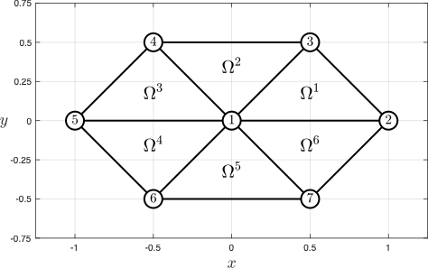
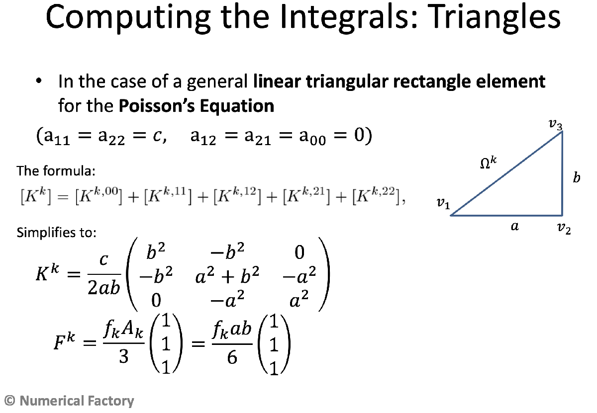

# 240032\-ex\-reava\-2023\-24
# P1

Consider the hexagonal domain shown in the figure, with nodes $(0,0)$ , $(1,0)$ , $(1/2,1/2)$ , $(-1/2,1/2)$ , $(-1,0)$ , $(-1/2,-1/2)$ , $(1/2,-1/2)$ . We want to solve the Poisson equation

 $$ -c\Delta u=5 $$ 

with $c=11$ using $6$ triangular elements by the right isosceles triangles of the figure.




# Part (a)

(a) (2 points) Let us choose a local numbering in element $\Omega^1$ given by the global nodes $2$ , $3$ and $1$ . Let $K^1$ be the local stiffness matrix at this element. Which is the value of $K_{1,1}^1$ ?

-  \-1.10e+01 
-  5.50e+00 ✅ 
-  Empty answer (no penalty) 
-  1.10e+01 
-  \-5.50e+00 
### **Solution**

To compute the local stiffness matrix of $\Omega^1$ , we can use the explicit formula that apply when the element $\Omega^k$ is a right triangle, with local node $2$ (global node $3$ ) placed at the right angle's vertex (see the figure above) and the coefficients of the model equation are constants and equal to $a_{1,1}^k =a_{2,2}^k =c$ , $a_{1,2}^k =a_{2,1}^k =a_{0,0}^k =0$ . This formula has been discussed in class and can be found [in the notes of the FEM available at the *Numerical Factory*](https://numfactory.upc.edu/numfactory/subjects/FEM/FEM/theory/T2-MN-FEM2D.pdf), page 28:





Here with $a=b=\sqrt{\frac{1}{2^2 }+\frac{1}{2^2 }}=\frac{1}{\sqrt{2}}=\frac{\sqrt{2}}{2}$ , and $c=11$ . Thus, application of the above formula for $K^k$ (here, for $k=1$ ) yields,

 $$ K^1 =\frac{11}{2\frac{\sqrt{2}}{2}\frac{\sqrt{2}}{2}}\left(\begin{array}{rrr} 1/2 & -1/2 & 0\newline -1/2 & 1 & -1/2\newline 0 & -1/2 & 1/2 \end{array}\right)=11\left(\begin{array}{rrr} 1/2 & -1/2 & 0\newline -1/2 & 1 & -1/2\newline 0 & -1/2 & 1/2 \end{array}\right)=\frac{11}{2}\left(\begin{array}{rrr} 1 & -1 & 0\newline -1 & 2 & -1\newline 0 & -1 & 1 \end{array}\right) $$ 

and therefore $K_{1,1}^1 =\frac{11}{2}=5.50$ .

```matlab
clearvars
close all

a = sqrt(2.0)/2.0;
b = a;
c = 11;
f = 5;

nodes = [
    0,0;
    1,0;
    1/2, 1/2;
    -1/2, 1/2;
    -1,0;
    -1/2,-1/2;
    1/2,-1/2
    ];

elem = [
    2, 3, 1;
    4, 1, 3;
    1, 4, 5;
    5, 6, 1;
    7, 1, 6;
    1, 7, 2
    ];
numNodes = size(nodes,1); %Number of nodes
numElem = size(elem,1);   %Number of elements

%numbering = 1;
%plotElements(nodes,elem,numbering)
%axis equal
%hold off
Ke = c * [
    b^2, -b^2, 0;
    -b^2, a^2 + b^2, -a^2;
    0, -a^2, a^2
    ]/a/b/2;

Fe = f*a*b*[1;1;1]/6;

fprintf('%12.8f%12.8f%12.8f%12.8f\n',[Ke,Fe].')
```

```matlabTextOutput
  5.50000000 -5.50000000  0.00000000  0.41666667
 -5.50000000 11.00000000 -5.50000000  0.41666667
  0.00000000 -5.50000000  5.50000000  0.41666667
```

```matlab
fprintf('(a) K1(1,1) = %.2f\n', Ke(1,1))
```

```matlabTextOutput
(a) K1(1,1) = 5.50
```
# Part (b)

(b) (2 points)  Give the value of $K_{1,1}$ of the assembled stiffness matrix K.

-  Empty answer (no penalty) 
-  1.10e+01 
-  \-1.10e+01 
-  1.65e+01 
-  4.40e+01✅ 

 **Hint:** The sum of any row or column is zero.

### Solution

It is clear from the figure that the local stiffness matrices are all aqual to $K^1$ , i.e., $K^e =K^1$ for $e=2,3,4,5,6$ . We can compute the whole stiffness matrix:

 $ $ \begin{array}{rcl} K & = & \left(\begin{array}{ccccccc} K_{3,3}^1 +K_{2,2}^2 +K_{1,1}^3 +K_{3,3}^4 +K_{2,2}^5 +K_{1,1}^6  & K_{3,1}^1 +K_{1,3}^6  & K_{3,2}^1 +K_{2,3}^2  & K_{2,1}^2 +K_{1,2}^3  & K_{1,3}^3 +K_{3,1}^4  & K_{3,2}^4 +K_{2,3}^5  & K_{2,1}^5 +K_{1,2}^6 \newline K_{1,3}^1 +K_{3,1}^6  & K_{1,1}^1 +K_{3,3}^6  & K_{1,2}^1  & 0 & 0 & 0 & K_{3,2}^6 \newline K_{2,3}^1 +K_{3,2}^2  & K_{2,1}^1  & K_{2,2}^1 +K_{3,3}^2  & K_{3,1}^2  & 0 & 0 & 0\newline K_{1,2}^2 +K_{2,1}^3  & 0 & K_{1,3}^2  & K_{1,1}^2 +K_{2,2}^3  & K_{2,3}^3  & 0 & 0\newline K_{3,1}^3 +K_{1,3}^4  & 0 & 0 & K_{3,2}^3  & K_{3,3}^3 +K_{1,1}^4  & K_{1,2}^4  & 0\newline K_{2,3}^4 +K_{3,2}^5  & 0 & 0 & 0 & K_{2,1}^4  & K_{2,2}^4 +K_{3,3}^5  & K_{3,1}^5 \newline K_{1,2}^5 +K_{2,1}^6  & K_{2,3}^6  & 0 & 0 & 0 & K_{1,3}^5  & K_{1,1}^5 +K_{2,2}^6  \end{array}\right)\\
 & = & \left(\begin{array}{ccccccc} 44 & 0 & -11 & -11 & 0 & -11 & -11\newline 0 & 11 & -11/2 & 0 & 0 & 0 & -11/2\newline -11 & -11/2 & 33/2 & 0 & 0 & 0 & 0\newline -11 & 0 & 0 & 33/2 & -11/2 & 0 & 0\newline 0 & 0 & 0 & -11/2 & 11 & -11/2 & 0\newline -11 & 0 & 0 & 0 & -11/2 & 33/2 & 0\newline -11 & -11/2 & 0 & 0 & 0 & 0 & 33/2 \end{array}\right).
\end{array} $ $ 

However, we recall that we're only asked for the component $K_{1,1}$ component of the global (i.e., the assembled) stiffness matrix. Hence,

 $$ K_{1,1} =K_{3,3}^1 +K_{2,2}^2 +K_{1,1}^3 +K_{3,3}^4 +K_{2,2}^5 +K_{1,1}^6 =\frac{11}{2}+11+\frac{11}{2}+\frac{11}{2}+11+\frac{11}{2}=22+22=44. $$ 

is the answer to the question.

```matlab
K = zeros(numNodes);
F = zeros(numNodes,1);
Q = zeros(numNodes,1);

for e = 1:numElem
    rows = [elem(e,1); elem(e,2); elem(e,3)];
    cols = rows;
    K(rows,cols) = K(rows,cols) + Ke;
    F(rows) = F(rows) + Fe;
end

fprintf('%10.5f%10.5f%10.5f%10.5f%10.5f%10.5f%10.5f%10.5f\n',[K, F].')
```

```matlabTextOutput
  44.00000   0.00000 -11.00000 -11.00000   0.00000 -11.00000 -11.00000   2.50000
   0.00000  11.00000  -5.50000   0.00000   0.00000   0.00000  -5.50000   0.83333
 -11.00000  -5.50000  16.50000   0.00000   0.00000   0.00000   0.00000   0.83333
 -11.00000   0.00000   0.00000  16.50000  -5.50000   0.00000   0.00000   0.83333
   0.00000   0.00000   0.00000  -5.50000  11.00000  -5.50000   0.00000   0.83333
 -11.00000   0.00000   0.00000   0.00000  -5.50000  16.50000   0.00000   0.83333
 -11.00000  -5.50000   0.00000   0.00000   0.00000   0.00000  16.50000   0.83333
```
# Part (c)

(c) (3 points) In this section we consider the essential boundary conditions givren by only $u=7$ at the boundary of the hexagon, that is, at the edges that join the vertices $2$ , $3$ , $4$ , $5$ , $6$ , and $7$ . Which is the value of $u$ at node $1$ ?

-  Empty answer (no penalty) 
-  7.3432e+00 
-  7.2789e+00 
-  6.7936e+00 
-  7.0568e+00 ✅ 
### Solution

First we shall assemble the local force vectors. To compute the local force vectors $F^e$ , $e=1,2,3,4,5,6,7$ , we shall use the formulas shown in Part (a), i.e.,

 $$ F^e  =\frac{f^e ab}{6}\left(\begin{array}{c} 1\newline 1\newline 1 \end{array}\right), $$ 

with $f^e =5$ for $e=1,2,3,4,5,6$ ; $a=b=\frac{\sqrt{2}}{2}$ , so $F^e =\frac{5}{12}\left(\begin{array}{c} 1\newline 1\newline 1 \end{array}\right)$ , $e=1,2,3,4,5,6$ . Then,


 $F=\left(\begin{array}{c} F_1 \newline F_2 \newline F_3 \newline F_4 \newline F_5 \newline F_6  \end{array}\right)=\left(\begin{array}{c} F_3^1 +F_2^2 +F_1^3 +F_3^4 +F_2^5 +F_1^6 \newline F_1^1 +F_3^6 \newline F_2^1 +F_3^2 \newline F_1^2 +F_2^3 \newline F_3^3 +F_1^4 \newline F_2^4 +F_3^5 \newline F_1^5 +F_2^6  \end{array}\right)=\frac{5}{6}\left(\begin{array}{c} 3\newline 1\newline 1\newline 1\newline 1\newline 1\newline 1 \end{array}\right)$ .


Note that, actually, we need only the first component of $F$ , i.e.,


 $F_1 =F_3^1 +F_2^2 +F_1^3 +F_3^4 +F_2^5 +F_1^6 =\frac{5}{2}$ .


As node $1$ is the only free node, the reduced system is derived straight from the first equation, i.e.,

 $$ K_{1,1} U_1 =F_1 +Q_1 -K_{1,2} U_2 -K_{1,3} U_3 -K_{1,4} U_4 -K_{1,5} U_5 -K_{16} U_6 -K_{1,7} U_7 $$ 

and note that the natural B.C. reduces to $Q_1 =0$ , for this is an internal node, and flux cancelllation applies. Substitution of $K_{1,1} =44$ , $K_{1,2} =0$ , $K_{1,3} =-11$ , $K_{1,4} =-11$ , $K_{1,5} =0$ , $K_{1,6} =-11$ , $K_{1,7} =-11$ ; $U_2 =U_3 =U_4 =U_5 =U_6 =U_7 =7$ ; $F_1 =5/2$ ; $Q_1 =0$ , gives the equation


 $44U_1 =5/2+0-0\times 7-11\times 7-11\times 7-0\times 7-11\times 7-11\times 7=\frac{5}{2}+44\times 7$ ,


which yields


 $U_1 =\frac{5}{88}+7=\frac{621}{18}=7.056\overline{81}$ .

```matlab
fixedNods = [2,3,4,5,6,7];
freeNods = setdiff(1:numNodes,fixedNods);

%Boundary conditions

%Essential B.C.
Q(1) = 0;

%Natural B.C.
u = zeros(numNodes,1);
u(fixedNods) = 7;

%Reduced system
Fm = F(freeNods) + Q(freeNods) - K(freeNods,fixedNods)*u(fixedNods);
Km =K(freeNods,freeNods);

%Solve the reduced system
um = Km\Fm;

u(freeNods) = um;

fprintf('(c) U(1) = %.12f\n',u(1))
```

```matlabTextOutput
(c) U(1) = 7.056818181818
```
# Part (d)

(d) (3 points) In this section, we replace the essential boundary conditions only on edges 2\-3 and 3\-4 by the following natural conditions. Fisrt assume that on the edge 2\-3 we take an insulating condition $q_n =0$ . Second, on the edge 3\-4 we consider the following condition $\frac{\partial u}{\partial y}=1+x$ . Which is the value of $Q_3$ in the assembled system?

-  Empty answer (no penalty) 
-  6.4167e+00 ✅ 
-  4.5833e+00 
-  8.2500e+00 
-  6.6819e+00 
### Solution
-  $q_{n,1}^1 \equiv 0$ on $\Gamma_1^1$ (edge 2\-3), so $Q_{2,1}^1 =0$ . 
-  $Q_{3,3}^2 =h_3^2 \left(\frac{1}{3}q_{n,3}^2 (1/2,1/2)+\frac{1}{6}q_{n,3}^2 (-1/2,1/2)\right)=1\cdot \left(\frac{1}{3}\times \frac{33}{2}+\frac{1}{6}\times \frac{11}{2}\right)=\frac{11}{2}\left(1+\frac{1}{6}\right)=\frac{77}{12}$ . Since $h_3^2 =1$ , $c=11$ , and: 

 $q_{n,3}^2 \left(\frac{1}{2},\frac{1}{2}\right)=\left\langle c\left(\begin{array}{c} \frac{\partial u}{\partial x}\left(\frac{1}{2},\frac{1}{2}\right)\newline \frac{\partial u}{\partial y}\left(\frac{1}{2},\frac{1}{2}\right) \end{array}\right),\left(\begin{array}{c} 0\newline 1 \end{array}\right)\right\rangle =c\frac{\partial u}{\partial y}\left(\frac{1}{2},\frac{1}{2}\right)=c\left(1+\frac{1}{2}\right)=11\times \frac{3}{2}=\frac{33}{2}$ ,


and


 $q_{n,3}^2 \left(-\frac{1}{2},\frac{1}{2}\right)=\left\langle c\left(\begin{array}{c} \frac{\partial u}{\partial x}\left(-\frac{1}{2},\frac{1}{2}\right)\newline \frac{\partial u}{\partial y}\left(-\frac{1}{2},\frac{1}{2}\right) \end{array}\right),\left(\begin{array}{c} 0\newline 1 \end{array}\right)\right\rangle =c\frac{\partial u}{\partial y}\left(-\frac{1}{2},\frac{1}{2}\right)=c\left(1-\frac{1}{2}\right)=\frac{11}{2}$ .


Therefore,

 $$ Q_3 =Q_{2,1}^1 +Q_{3,3}^2 =0+\frac{77}{12}=6.41\overline{6} . $$ 
```matlab
qn23 = @(x,y) c*(1+x);
qn11 = 0;
h11 = a; 
h23 = 1.0;
Q121 = h11*qn11/2;
Q233 = h23 * (qn23(1/2,1/2)/3 + qn23(-1/2,1/2)/6); 
Q(3) = Q121 + Q233;

fprintf('(d) Q(3) = %.12f\n',Q(3))               
```

```matlabTextOutput
(d) Q(3) = 6.416666666667
```
